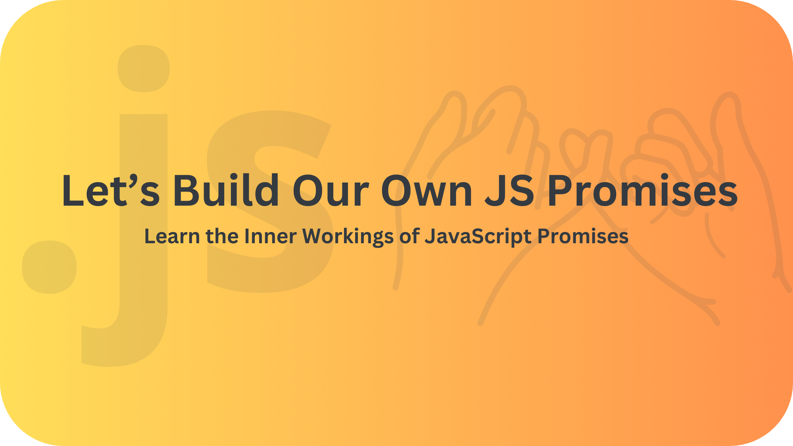

# Let's Build Our Own JS Promises



## Introduction

Promises are a way to handle asynchronous operations in JS. so it is important to understand how they work and for that reason, I decide to implement my own version of promises, to deeply understand how they work.

## Design

## File Structure

I rely on simple and easy-to-understand file structure, as shown below:

- `src` folder contains the source code of the project.
  - `src/index.js` is the entry point of the project which contains `MyPromise` class.
- `test` folder contains the test cases for the project.
- `.prettierrc` file contains the configuration for Prettier.
- `package.json` file contains the metadata of the project.

## Installation

To install the project, you can follow these steps:

1. Clone the repository using the following command:

   ```bash
   git clone <repo_url>
   ```

2. Navigate to the project directory:

   ```bash
   cd <project_name>
   ```

3. Install the dependencies:

   ```bash
   npm install
   ```

4. Run the tests:

   ```bash
   npm test
   ```

## Usage

To use the `MyPromise` class, you can follow these steps:

1. Import the `MyPromise` class:

   ```javascript
   const MyPromise = require('./src/index');
   ```

2. Create a new instance of the `MyPromise` class:

   ```javascript
   const promise = new MyPromise((resolve, reject) => {
     setTimeout(() => {
       resolve('Hello, World!');
     }, 1000);
   });
   ```

3. Use the `then` method to handle the resolved value:

   ```javascript
   promise.then((value) => {
     console.log(value);
   });
   ```

4. Use the `catch` method to handle the rejected value:

   ```javascript
   promise.catch((error) => {
     console.error(error);
   });
   ```

5. Use the `finally` method to handle the resolved or rejected value:

   ```javascript
   promise.finally(() => {
     console.log('Promise is settled');
   });
   ```

Enjoy using the other methods of the `MyPromise` class!

## Helpful Resources

- [MDN Web Docs](https://developer.mozilla.org/en-US/docs/Web/JavaScript/Reference/Global_Objects/Promise)
- [JavaScript Visualized - Promise Execution By Lydia Hallie](https://www.youtube.com/watch?v=Xs1EMmBLpn4)

## Contributions

I will be happy to receive any contributions from anyone who is interested in this repository. You can contribute by adding new features, fixing bugs, improving the documentation, or suggesting new ideas.

## License

<!-- TODO: Add project license -->

<!-- This project is licensed under the MIT License - see the [LICENSE](./LICENSE) file for details. -->
